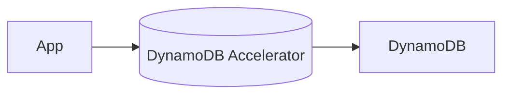
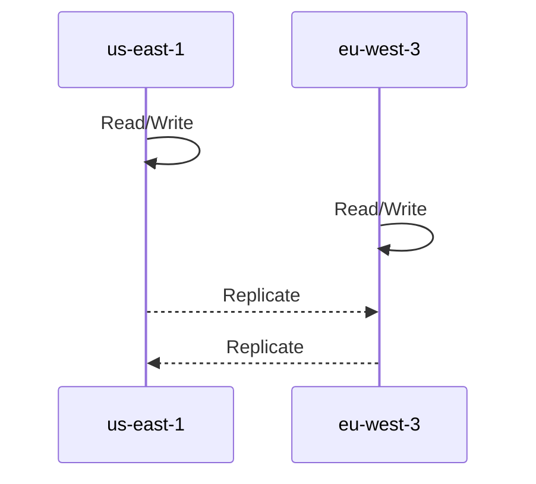

## What Is DynamoDB?

DynamoDB is a **fully managed, serverless, NoSQL key–value database** that provides:

- **High availability** (replication across 3 AZs)
- **Massive scalability** (millions of requests/sec)
- **Single-digit millisecond performance**
- **No server provisioning**
- **Low operational overhead**

It is one of AWS’s flagship database services.

---

## Key Characteristics

### 🔥 Core Features

| Feature | Description |
| --- | --- |
| **NoSQL (Key–Value)** | Flexible schema, no fixed tables like SQL |
| **Serverless** | No instance provisioning; AWS manages everything |
| **Highly scalable** | Trillions of rows, hundreds of TB storage |
| **Fast performance** | Consistent single-digit ms latency |
| **3-AZ replication** | Built-in fault tolerance |
| **Integrated with IAM** | Fine-grained security and access control |
| **Auto scaling** | On-demand capacity management |
| **Two table classes** | Standard & Infrequent Access (IA) |

---

## Data Model Overview

### 🗂 Table Structure

DynamoDB stores data in **items**, similar to rows.

Each item contains:

- **Primary Key**
    - Partition Key only **OR**
    - Partition Key + Sort Key
- **Attributes**
    - Flexible fields (strings, numbers, lists, maps, etc.)

Example:

```plain text
{
  "UserId": "123",            // partition key
  "OrderId": "A001",          // sort key (optional)
  "Name": "John",
  "Age": 30,
  "Address": { "City": "NYC" },
  "Tags": ["vip", "premium"]
}


```

---

## When to Use DynamoDB

Look for these exam keywords:

- **Serverless**
- **Low latency retrieval**
- **Highly scalable workloads**
- **Document / key-value data**
- **Massive traffic / unpredictable spikes**

Typical use cases:

- Gaming leaderboards
- Shopping carts
- IoT device data
- User profiles
- Real-time analytics

---

## DynamoDB Accelerator (DAX)

### ⚡ What Is DAX?

DAX = **In-memory cache specifically built for DynamoDB**

(Do NOT confuse with ElastiCache)

Benefits:

- **Microsecond latency** (10× faster than DynamoDB alone)
- Fully managed and fault-tolerant
- Drop-in integration—no code rewrite needed

### Architecture



Use DAX when:

- You need the absolute fastest reads
- Your workload is read-heavy
- You want caching tightly coupled with DynamoDB

---

## DynamoDB Global Tables

### 🌍 What Are Global Tables?

A **multi-region, fully replicated DynamoDB table**

that supports **active-active writes** across regions.

Example:



### Benefits

- **Global low-latency access**
- **Active-active replication**
- **Automatic conflict resolution**
- **Great for global applications**

### Common Exam Keywords

- “Users from multiple continents need low-latency access.”
- “Multi-region write capability.”
- “Active-active replication.”
- “Fully managed global database.”